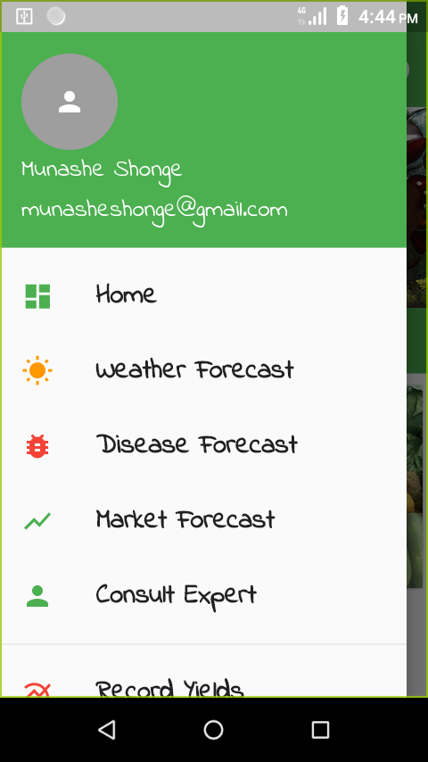
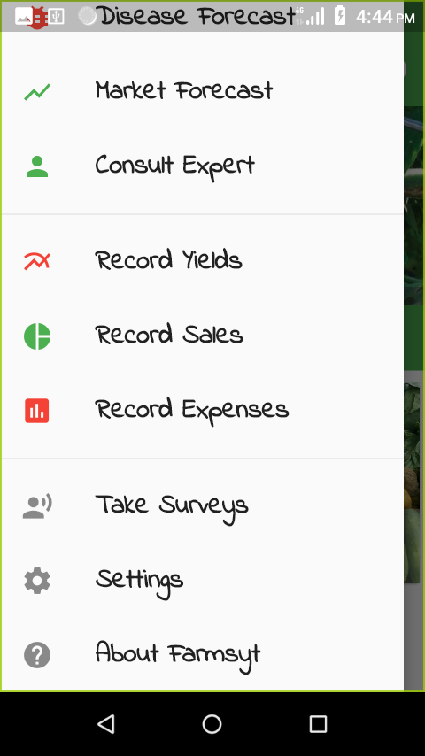
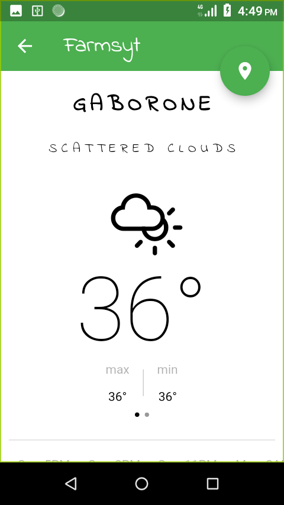
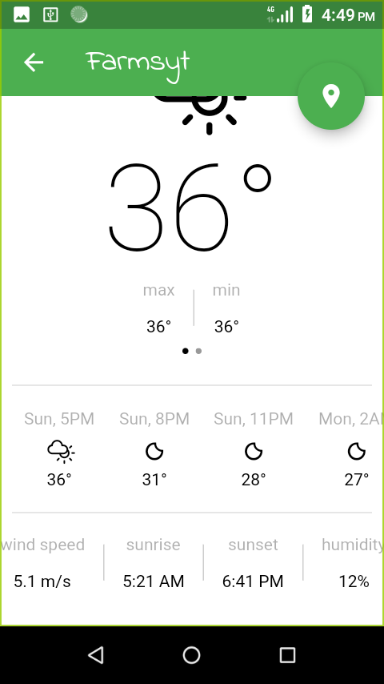
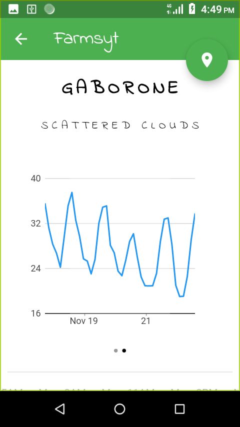
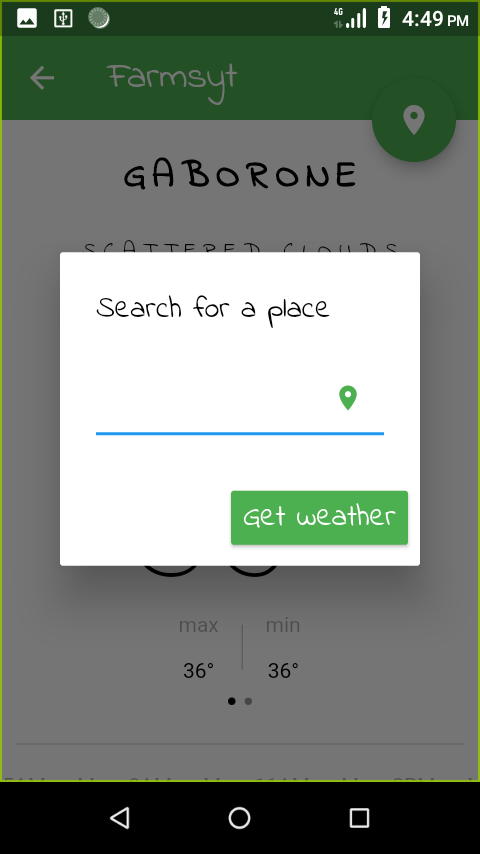

# Farmsyt :sunny: :bug: :rooster: :tomato:

Beginner Flutter-based app for smallholder farmers on the go.

Farmsyst is a mobile farm management tool that is data-centric. The goal is to enable smallholder farmers to capture their daily farm data on the move and also receive valuable forecast data like weather etc for planning.

 

# :camera: App Screenshots  

<table>

<tr>
    <td>
        
    </td>
    <td>
        
    </td>
     <td>
        
    </td>
</tr>

<tr>
    <td>
        
    </td>
    <td>
        
    </td>
    <td>
        
    </td>
</tr>

<tr>   
    <td>
        
    </td>
    <td>
     
    </td>
</tr>

</table>

 

# LICENSE
 
<a href="http://www.apache.org/licenses/LICENSE-2.0"> Apache License, Version 2.0 </a> 
Copyright [2019] [Munashe Shonge]

   Licensed under the Apache License, Version 2.0 (the "License");
   you may not use this file except in compliance with the License.
   You may obtain a copy of the License at

     http://www.apache.org/licenses/LICENSE-2.0

   Unless required by applicable law or agreed to in writing, software
   distributed under the License is distributed on an "AS IS" BASIS,
   WITHOUT WARRANTIES OR CONDITIONS OF ANY KIND, either express or implied.
   See the License for the specific language governing permissions and
   limitations under the License.
