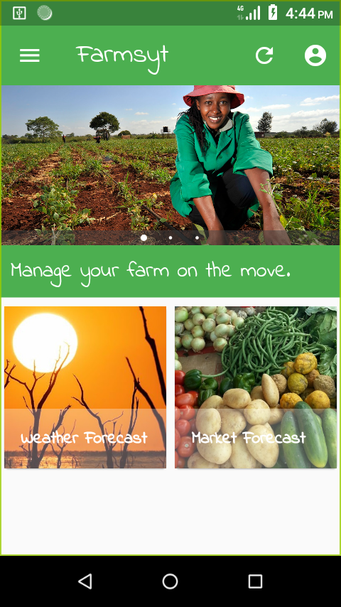

# Farmsyt :sunny: :bug: :rooster: :tomato:

Beginner Flutter-based app for smallholder farmers on the go.

Farmsyst is a mobile farm management tool that is data-centric. The goal is to enable smallholder farmers to capture their daily farm data on the move and also receive valuable forecast data like weather etc for planning.

